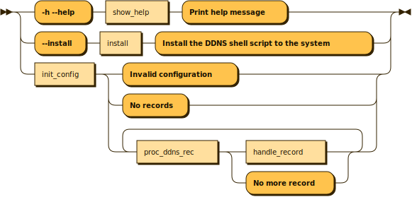

<p align="left">
  <a href="README.md">English</a> | 中文
</p>

<div align="center">
  <h1>动态域名地址同步程序: ddnss.sh</h1>
</div>

<p align="center">
  <a href="https://github.com/qingzi-zhang/ddnss.sh/blob/main/LICENSE">
    
  </a>
</p>

- 纯 Shell script 语言编写的动态域名客户端
- 兼容 POSIX 标准 ，已测试通过 bash, dropbear ssh 和 sh
- 代码和配置一共不到 20 KB，对运行环境的要求非常低，易于使用和维护

## 已支持的动态域名类型

名称|API 版本|状态
----|:--:|:--:|
腾讯云 DNSPod|V3|✅

# 安装
## 先安装运行工具： cURL(命令行数据传输工具) 和 OpenSSL(开源加密命令行工具)
- ***Debian系统***
```
sudo apt update
sudo apt install curl openssl
```
- ***OpenWrt系统***
```
opkg update
opkg install curl openssl-util
```

## 复制源代码和设置
```
git clone https://github.com/qingzi-zhang/ddns.sh
ddnss_home="${HOME}/.ddnss.sh"
mkdir -p "${ddnss_home}"
mkdir -p -m 0700 "/var/log/ddnss/"
cp ddnss.sh/config/ddnss.conf "${ddnss_home}/ddnss.conf"
cp ddnss.sh/scripts/ddnss.sh "${ddnss_home}"
chmod 0700 "${ddnss_home}/ddnss.sh"
echo 'alias ddnss.sh="'${ddnss_home}/ddnss.sh'"' > "${ddnss_home}/ddnss.sh.env"
source "${ddnss_home}/ddnss.sh.env"
```
> [!NOTE]
> 可选项 - 环境变量加到 .profile 中，不用每次运行时加载: _`source $HOME/.ddnss.sh/ddnss.sh.env`_
>
> 或创建一个软链接 `ln -s $HOME/.ddnss.sh/ddnss.sh /usr/bin/ddnss.sh` 以便于使用

# 配置参数
默认配置在: **`$HOME/.ddnss.sh/ddnss.conf`**，根据需要进行调整
> [!NOTE]
> Optional - Log_File: 日志文件应放在目录 /var/log/ 或子目录中，并且至少对ddnss.log和ddnss.log.bak文件具有写入的权限
- Log_File=`/var/log/ddnss/ddnss.log`
> 安全认证的id和key，从腾讯云获取
- Tencent_SecretId=`AKIDz8krbsJ5yKBZQpn74WFkmLPx3*******`
- Tencent_SecretKey=`Gu5t9xGARNpq86cd98joQYCN3*******`
> [!TIP]
> 格式为: `DDNS=domain fullname,ip_version,interface,eui64_suffix`
- DDNS=`ai.ddns-shell.com,IPv6,br-lan,07e2:00c:0012:aaaa`

# 使用方法为执行脚本：ddnss.sh
```
Usage:
  ddnss.sh [options]

Options:
  -h, --help           打印帮助信息
  --config=<file>      选项将指定特定的配置文件
  --force-update       选择此选项将对动态域名进行同步，无论IP和动态域名的状态已经同步
  --log-level=<0|1>    提示等级 (0: 仅提示错误, 1: 提示更多的信息)
```

# 程序运行流程图
## 主流程迷你图

## 初始化流程图

## 记录处理流程图
